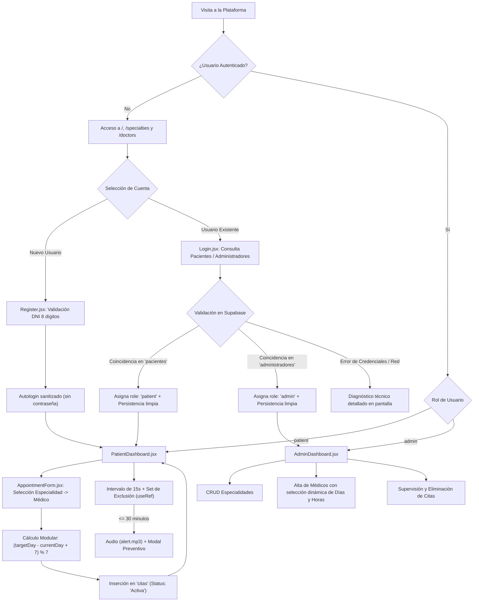

# Clínica Salud+ | Sistema de Gestión de Consultas y Agendamiento Médico Ambulatorio

Plataforma web de alto rendimiento orientada a la digitalización, control operativo y agendamiento autoservicio de consultas médicas ambulatorias. Diseñada bajo el estándar arquitectónico de Single Page Application (SPA) desacoplada con Backend as a Service (BaaS), incorpora sincronización relacional en tiempo real, cálculo modular de calendarios clínicos y un sistema de diseño minimalista inspirado en los principios de Apple Human Interface Guidelines y Glassmorphism.

---

## 1. Visión General y Propósito del Sistema

### 1.1 Descripción del Producto
Clínica Salud+ es una solución tecnológica integral concebida para modernizar la atención médica ambulatoria. El sistema elimina la intermediación manual en la reserva de turnos, centraliza la disponibilidad horaria del personal facultativo y proporciona mecanismos proactivos de notificación para optimizar la tasa de puntualidad y asistencia en centros de salud.

### 1.2 Roles de Usuario y Capacidades Operativas
* **Paciente (`patient`):**
  * Registro de identidad con validación estricta de documento de identidad (DNI de 8 dígitos).
  * Exploración del catálogo dinámico de especialidades y médicos tratantes.
  * Selección de turnos en tiempo real mediante cálculo de fechas relativas y franjas horarias configurables.
  * Monitoreo de citas programadas (clasificadas en Activas, Vencidas o Canceladas).
  * Activación de recordatorios preventivos con alertas acústicas y visuales a 30 minutos de la consulta.
* **Administrador (`admin`):**
  * Parametrización y mantenimiento del catálogo de especialidades médicas (CRUD).
  * Alta de médicos con asignación de especialidad y definición flexible de turnos laborales (días y horas de atención vía estructuras JSONB).
  * Auditoría y supervisión global del historial de citas registradas en la institución.
  * Cancelación o depuración de registros con confirmación preventiva en interfaz.

### 1.3 Problemática Operativa Resuelta
* **Colapso de Canales de Atención Tradicionales:** Sustituye las líneas telefónicas y la recepción física por una ventanilla única digital disponible 24/7.
* **Ausentismo de Pacientes (No-Show Rate):** Mitiga el abandono de turnos mediante un motor de inspección en segundo plano que despacha notificaciones automáticas previas a la consulta.
* **Rigidez en la Parametrización Médica:** Permite a la directiva modificar la carga horaria y días de atención de los médicos de forma instantánea sin requerir cambios a nivel de código o despliegue.

---

## 2. Arquitectura de Software y Stack Tecnológico

El sistema implementa una arquitectura desacoplada basada en el patrón Jamstack / BaaS:

```
+-------------------------------------------------------------------------+
|                           ARQUITECTURA DEL SISTEMA                      |
+-------------------------------------------------------------------------+

  [Cliente Web: SPA]
         │
         ├── React 19.1 + React Router DOM 7.9 (Renderizado declarativo y rutas)
         ├── Apple Design System + Glassmorphism (index.css)
         ├── Motor de Diagnóstico y Estado en Tiempo Real (App.jsx)
         │
         ▼  (HTTPS / WSS / REST API)
  [Supabase BaaS]
         │
         ├── PostgREST (Capa de abstracción RESTful automática)
         ├── Row Level Security (RLS) & JWT Authentication
         │
         ▼
  [Base de Datos Relacional: PostgreSQL]
         ├── Tablas Relacionales (pacientes, administradores, especialidades, medicos, citas)
         └── Tipos Complejos (Columnas JSONB para días y franjas horarias)
```

### 2.1 Especificación del Stack Tecnológico
* **Frontend Core:**
  * `react` (v19.1.1): Construcción de interfaces reactivas y gestión de estado mediante Hooks funcionales.
  * `react-dom` (v19.1.1): Adaptador de montaje y manipulación optimizada del Virtual DOM.
  * `react-router-dom` (v7.9.5): Enrutamiento del lado del cliente, control de historial y guardianes de autorización.
* **Persistencia y Backend as a Service:**
  * `@supabase/supabase-js` (v2.79.0): Cliente SDK oficial para operaciones CRUD, consultas relacionales con joins declarativos y manejo de errores.
  * `PostgreSQL` (Motor Supabase): Base de datos relacional con integridad referencial, llaves foráneas y soporte nativo para JSONB.
* **Estilos y Componentes de Interfaz:**
  * `bootstrap` (v5.3.8) y `react-bootstrap` (v2.10.10): Estructura de rejilla adaptativa (*grid system*) y utilidades de espaciado.
  * `Hoja de estilos personalizada` (`src/index.css`): Implementación pura de desenfoque de fondo (*backdrop blur*), gradientes etéreos, sombras multicapa, botones píldora y microinteracciones de escala activa.
* **Tooling y Compilación:**
  * `vite` (v7.1.7): Herramienta de compilación ultrarrápida impulsada por Rollup y ESBuild con Hot Module Replacement (HMR).
  * `@vitejs/plugin-react` (v5.0.4): Transformación de JSX con soporte para Fast Refresh.
  * `eslint` (v9.36.0): Análisis estático de código para garantizar buenas prácticas y adherencia a estándares de React Hooks.

---

## 3. Estructura del Proyecto y Módulos Clave

### 3.1 Árbol de Directorios del Código Fuente

```text
src/
├── Components/
│   ├── ConfirmModal.jsx           # Diálogo modal no bloqueante accesible estilo Apple
│   ├── DatabaseStatusIndicator.jsx# Monitor de conectividad en tiempo real con Supabase
│   ├── Footer.jsx                 # Pie de página institucional y créditos
│   ├── Icons.jsx                  # Colección centralizada de iconos vectoriales SVG discretos
│   ├── Navbar.jsx                 # Barra de navegación frosted-glass con indicador de estado
│   └── ProtectedRoute.jsx         # Guardián de rutas con validación de roles en tiempo de render
├── Pages/
│   ├── AdminDashboard.jsx         # Consola de administración (CRUD de catálogo y médicos)
│   ├── AppointmentForm.jsx        # Módulo de reserva con cálculo modular de días y horas
│   ├── Especialidades.jsx         # Directorio visual de especialidades médicas
│   ├── Home.jsx                   # Pantalla de inicio y presentación de servicios
│   ├── Login.jsx                  # Autenticación dual con diagnóstico detallado de credenciales
│   ├── Medicos.jsx                # Directorio clínico de profesionales y horarios
│   ├── PatientDashboard.jsx       # Consola de paciente con motor de alertas preventivas
│   └── Register.jsx               # Registro de pacientes con validación estricta de DNI
├── App.jsx                        # Orquestador raíz, enrutador y sincronización global de estado
├── index.css                      # Sistema de diseño Apple Human Interface y Glassmorphism
├── main.jsx                       # Punto de entrada de la aplicación y montaje en DOM
└── supabase.js                    # Inicialización desacoplada del cliente Supabase
```

### 3.2 Patrón de Enrutamiento y Guardianes de Acceso (`ProtectedRoute.jsx`)
La seguridad en la navegación está controlada por el componente envoltorio `ProtectedRoute`, el cual intercepta el flujo según las siguientes reglas:
1. **Verificación de Sesión:** Si la propiedad `user` es nula, el usuario es redirigido inmediatamente a `/login` preservando el estado de redirección (`replace`).
2. **Validación de Rol Requerido (`requiredRole`):** Si la ruta exige un rol específico (`patient` o `admin`) y el rol del usuario no coincide, se ejecuta una redirección automática al panel correspondiente:
   * Administrador intentando acceder a ruta de paciente -> Redirigido a `/admin-dashboard`.
   * Paciente intentando acceder a ruta de administración -> Redirigido a `/patient-dashboard`.
3. **Paso Concedido:** Si las credenciales y roles satisfacen los criterios, se renderizan los componentes hijos (`children`).

---

## 4. Flujo Operativo del Sistema



### 4.1 Especificación del Portal del Paciente
* **Registro de Identidad:** Captura nombre, apellido, DNI, contraseña, teléfono y correo electrónico. Aplica validación estricta de longitud y formato (`/^\d{8}$/`) y verifica previamente la ausencia de duplicados en la base de datos.
* **Reserva de Citas sin Bloqueos:**
  * Filtra en cascada los médicos asociados a la especialidad seleccionada.
  * Lee de forma segura los arreglos de días y franjas horarias configurados para el médico.
  * Realiza el cálculo modular de la fecha objetivo a medianoche local, evitando saltos de zona horaria o valores negativos.
* **Supervisión de Citas y Alertas:**
  * Determina en tiempo de ejecución si la cita se encuentra `Activa`, `Vencida` o `Cancelada`.
  * Permite conmutar la recepción del recordatorio con persistencia inmediata en la tabla `citas`.
  * Ejecuta una comprobación cada 15 segundos con exclusión por identificador (`useRef(new Set())`) para disparar la alarma preventiva de 30 minutos sin duplicados.

### 4.2 Especificación del Portal del Administrador
* **Gobernanza de Especialidades:** Alta de ramas clínicas e inactivación inmediata propagada al estado global de la aplicación.
* **Configuración Paramétrica de Médicos:** Formulario que prescinde de valores estáticos fijos, permitiendo seleccionar de forma interactiva los días de la semana y turnos horarios mediante controles tipo chip, además de posibilitar el ingreso de horas personalizadas en formato `HH:MM`.
* **Supervisión del Historial:** Tabla integral de citas con join relacional a pacientes y médicos, con soporte para cancelación definitiva protegida por confirmación modal.

---

## 5. Modelo de Datos Relacional (PostgreSQL / Supabase)

### 5.1 Diagrama de Arquitectura de Datos (ASCII)

```
+---------------------------------------------------------------------------------+
|                         DIAGRAMA ENTIDAD-RELACIÓN (ER)                          |
+---------------------------------------------------------------------------------+

 [pacientes]
    ├── id: bigint / uuid (PK)
    ├── nombre: text
    ├── apellido: text
    ├── dni: text (UNIQUE, 8 dígitos)
    ├── contraseña: text
    ├── telefono: text
    └── correo: text
           │
           │ 1
           │
           │ N
           ▼
 [citas]
    ├── id: bigint (PK, GENERATED ALWAYS AS IDENTITY)
    ├── fecha: text (Formato YYYY-MM-DD)
    ├── hora: text (Formato HH:MM)
    ├── status: text ('Activa' | 'Cancelada')
    ├── reminder: boolean (DEFAULT false)
    ├── paciente_id: bigint (FK -> pacientes.id)
    └── medico_id: bigint (FK -> medicos.id)
           ▲
           │ N
           │
           │ 1
 [medicos]
    ├── id: bigint (PK, GENERATED ALWAYS AS IDENTITY)
    ├── nombre: text
    ├── especialidad_id: bigint (FK -> especialidades.id)
    ├── dias: jsonb (Array de strings: ["Lunes", "Miércoles", ...])
    └── horas: jsonb (Array de strings: ["08:00", "09:00", ...])
           │
           │ N
           │
           │ 1
           ▼
 [especialidades]
    ├── id: bigint (PK, GENERATED ALWAYS AS IDENTITY)
    └── nombre: text (UNIQUE)

 [administradores]
    ├── id: bigint / uuid (PK)
    ├── nombre: text
    ├── dni: text (UNIQUE)
    └── contraseña: text
```

### 5.2 Diccionario de Datos

| Tabla | Columna | Tipo de Dato | Restricción / Índice | Descripción |
| :--- | :--- | :--- | :--- | :--- |
| **`pacientes`** | `id` | `bigint` / `uuid` | PRIMARY KEY | Identificador único del paciente. |
| | `nombre` | `text` | NOT NULL | Nombres del paciente. |
| | `apellido` | `text` | NOT NULL | Apellidos del paciente. |
| | `dni` | `text` | NOT NULL, UNIQUE | Documento de identidad (exactamente 8 dígitos). |
| | `contraseña` | `text` | NOT NULL | Clave de acceso a la plataforma. |
| | `telefono` | `text` | NOT NULL | Teléfono de contacto. |
| | `correo` | `text` | NOT NULL | Dirección de correo electrónico. |
| **`administradores`** | `id` | `bigint` / `uuid` | PRIMARY KEY | Identificador único del administrador. |
| | `nombre` | `text` | NOT NULL | Nombre de la autoridad administrativa. |
| | `dni` | `text` | NOT NULL, UNIQUE | Identificación de acceso administrativo. |
| | `contraseña` | `text` | NOT NULL | Clave de acceso a la consola. |
| **`especialidades`** | `id` | `bigint` | PRIMARY KEY, IDENTITY | Identificador único de la especialidad. |
| | `nombre` | `text` | NOT NULL, UNIQUE | Denominación del área médica. |
| **`medicos`** | `id` | `bigint` | PRIMARY KEY, IDENTITY | Identificador único del médico. |
| | `nombre` | `text` | NOT NULL | Nombre profesional del médico. |
| | `especialidad_id` | `bigint` | FOREIGN KEY | Referencia a `especialidades.id`. |
| | `dias` | `jsonb` | NOT NULL | Arreglo de días hábiles de consulta. |
| | `horas` | `jsonb` | NOT NULL | Arreglo de turnos horarios de atención. |
| **`citas`** | `id` | `bigint` | PRIMARY KEY, IDENTITY | Identificador de la reserva médica. |
| | `fecha` | `text` | NOT NULL | Fecha agendada en formato `YYYY-MM-DD`. |
| | `hora` | `text` | NOT NULL | Hora asignada en formato militar `HH:MM`. |
| | `status` | `text` | NOT NULL | Estado operativo (`'Activa'` o `'Cancelada'`). |
| | `reminder` | `boolean` | DEFAULT `false` | Bandera de activación de alarma preventiva. |
| | `paciente_id` | `bigint` | FOREIGN KEY | Referencia a `pacientes.id`. |
| | `medico_id` | `bigint` | FOREIGN KEY | Referencia a `medicos.id`. |

---

## 6. Ingeniería de Refactorización y Mitigación de Deuda Técnica

Durante el proceso de reestructuración y saneamiento del código heredado, se corrigieron vulnerabilidades críticas y defectos lógicos que afectaban la estabilidad operativa:

### 6.1 Corrección de Bloqueo por Bucle Infinito en Calendario
* **Defecto Heredado:** La función de selección de turnos implementaba un bucle `while (date.getDay() !== targetDay)` que incrementaba la fecha día a día. Si el arreglo de días contenía nombres con caracteres acentuados (ej. *"Miércoles"* vs *"miercoles"*), la función `findIndex` retornaba `-1`, provocando que la condición nunca se cumpliera y bloqueando de manera irreversible el hilo principal del navegador.
* **Solución Implementada:** Sustitución por normalización NFD (eliminación de diacríticos) y cálculo por aritmética modular:
  ```javascript
  const normalizeDayName = (str) =>
    String(str || "").normalize("NFD").replace(/[\u0300-\u036f]/g, "").toLowerCase().trim();

  const diff = (targetDay - currentDay + 7) % 7;
  targetDate.setDate(today.getDate() + diff);
  ```
  La operación se resuelve en complejidad de tiempo constante $\mathcal{O}(1)$ sin riesgo de iteración infinita.

### 6.2 Eliminación de Saturación de Alertas vía Throttling con `useRef`
* **Defecto Heredado:** El intervalo de monitoreo de recordatorios evaluaba la condición de proximidad (30 minutos) cada 15 segundos y ejecutaba el sonido de alerta y la notificación del sistema en cada ciclo, generando spam acústico y visual para el usuario.
* **Solución Implementada:** Integración de una referencia mutable persistente `useRef(new Set())`. Al detonar una alerta, el identificador único de la cita se registra en el conjunto; en las evaluaciones posteriores del ciclo de vida, se verifica `!notifiedAppointmentsRef.current.has(app.id)`, garantizando que cada turno sea notificado exactamente una sola vez.

### 6.3 Corrección de Fuga de Credenciales y Sanitización de Estado
* **Defecto Heredado:** Al completar la autenticación o el registro, la entidad de usuario completa (incluyendo el campo sensible `contraseña`) era persistida directamente en el almacenamiento local del navegador (`localStorage`) y en el estado global.
* **Solución Implementada:** Desestructuración y exclusión explícita del hash o contraseña antes de propagar la sesión:
  ```javascript
  const { contraseña: _, ...sanitizedUser } = record;
  const userData = { ...sanitizedUser, role: "patient" };
  setUser(userData);
  localStorage.setItem("user", JSON.stringify(userData));
  ```

### 6.4 Corrección del Bypass en Control de Acceso (`ProtectedRoute.jsx`)
* **Defecto Heredado:** El guardián de rutas únicamente comprobaba la existencia del usuario (`if (!user)`), ignorando la validación del rol requerido. Esto permitía a cualquier paciente autenticado ingresar manualmente a la URL `/admin-dashboard`.
* **Solución Implementada:** Evaluación estricta de roles con redirección compensatoria bidireccional basada en el atributo `requiredRole`.

### 6.5 Manejo Defensivo de Estructuras JSONB
* **Defecto Heredado:** Los atributos `dias` y `horas` de los médicos se consumían asumiendo arrays puros. Si la base de datos retornaba una cadena serializada o nulo, la interfaz colapsaba con un error en tiempo de ejecución.
* **Solución Implementada:** Implementación de la función `parseSafeArray` que valida el tipo, interpreta JSON serializado con bloque seguro `try/catch` y asegura fallbacks a arrays vacíos.

### 6.6 Sistema de Diseño Apple Human Interface Guidelines y Glassmorphism
* **Eliminación Total de Emojis:** Se erradicaron todos los caracteres emoji no estándar en botones, títulos y alertas, reemplazándolos por una biblioteca coherente de componentes vectoriales SVG discretos (`Icons.jsx`).
* **Erradicación de Modales Nativos:** Supresión de `alert()` y `confirm()`. Se incorporó el componente no bloqueante `ConfirmModal` con efecto frosted-glass (`backdrop-filter: blur(20px)`), respetando la armonía visual corporativa.

---

## 7. Instalación, Configuración y Puesta en Marcha

### 7.1 Requisitos del Entorno
* **Node.js:** Versión 18.0.0 o superior (recomendado: Node.js 20 LTS o 22 LTS).
* **NPM:** Versión 9.0.0 o superior.
* **Navegador Web:** Compatible con especificación ECMAScript 2022 y CSS Backdrop Filter (Chrome 76+, Safari 13.1+, Firefox 103+, Edge 79+).

### 7.2 Configuración de Variables de Entorno (`.env`)
Crear un archivo nombrado `.env` en la raíz del proyecto configurando los parámetros de enlace con Supabase:

```env
# URL base del proyecto en Supabase
VITE_SUPABASE_URL=https://tu-proyecto.supabase.co

# Llave pública anónima (anon public key)
VITE_SUPABASE_ANON_KEY=tu-clave-anonima-jwt
```

### 7.3 Comandos de Ejecución y Despliegue

```bash
# 1. Instalar dependencias del proyecto
npm install

# 2. Iniciar el servidor local de desarrollo con HMR
npm run dev

# 3. Ejecutar análisis estático de código (linter)
npm run lint

# 4. Compilar y empaquetar para producción (genera bundle en /dist)
npm run build

# 5. Previsualizar localmente el compilado de producción
npm run preview
```

### 7.4 Verificación de Integridad de Compilación
El proyecto compila de manera limpia sin advertencias de dependencias ni fallas de tipado en Vite:

```text
vite building for production...
transforming...
[OK] 142 modules transformed.
rendering chunks...
computing gzip size...
dist/index.html                   0.48 kB │ gzip:   0.33 kB
dist/assets/index-BpBe9GAq.css  239.25 kB │ gzip:  33.08 kB
dist/assets/index-DNCpxkMR.js   462.51 kB │ gzip: 131.49 kB
[OK] built in 2.08s
```
---

## 8. Licencia y Derechos de Autor

Este proyecto fue desarrollado con fines de exhibición técnica, portafolio profesional y demostración de arquitectura de software.

```text
Copyright (c) 2025 - 2026 Alexander Exequiel Valverde Reyes. Todos los derechos reservados.